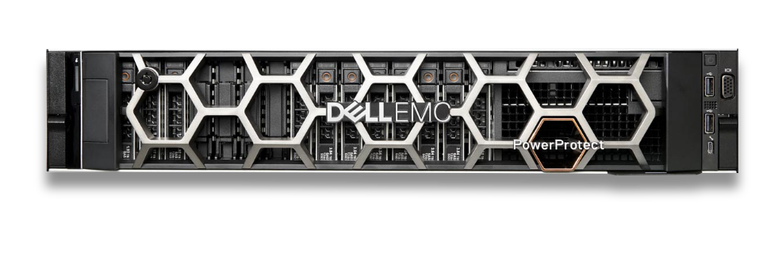
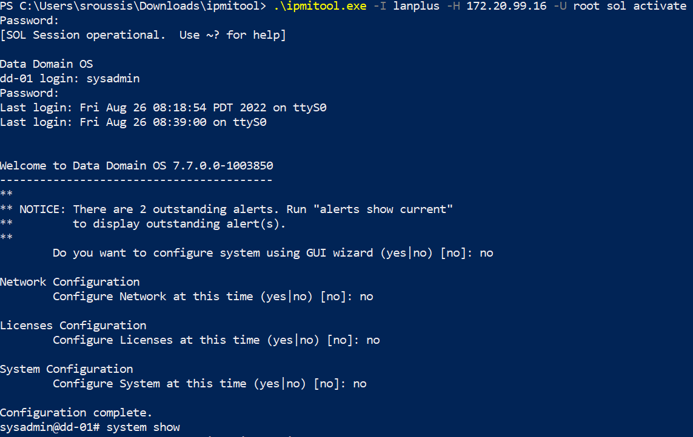

+++ 
draft = false
date = 2022-08-27T20:27:18+03:00
title = "Dell PowerProtect DD3300 Initial Configuration"
description = "Setting up Dell PowerProtect DD3300 with iDRAC SOL and IPMI"
slug = ""
authors = ["Sotirios Roussis"]
tags = ["systems"]
categories = ["hardware", "storage"]
externalLink = ""
series = ["dell"]
+++



# Prerequisites

* Rack mounted
* Power and data cables connected
* iDRAC network interface connected to your laptop with ethernet
* Note down the serial number that is located on the PSNT (this is the default iDRAC password)
* Power on!

# Setting up iDRAC

Firstly, connect to iDRAC with an ethernet cable (no switches involved). Configure your local network interface with a static IP address and no gateway:

| IP | Subnet Mask | Gateway |
|-|-|-|
| 192.168.0.10 | 255.255.255.0 | Empty |

Then, open up a web browser and navigate to [https://192.168.0.120](https://192.168.0.120). Sign in with the default credentials (password is the serial number, check PSNT):

| Username | Password |
|-|-|
| root | SERIAL_NUMBER_HERE_IN_UPPERCASE |

Change the default IPv4 address by navigating to `iDRAC Settings > Connectivity > Network > IPv4 Settings`

| Name | Value |
|-|-|
| Enabled IPv4 | Enabled |
| DHCP | Disabled |
| Static IP Address | `172.20.99.16` |
| Static Gateway | `172.20.99.1` |
| Static Subnet Mask | `255.255.255.0` |
| Use DHCP to Obtain DNS Server Addresses | Disabled |
| Static Preferred DNS Server | `172.20.11.30` |
| Static Alternate DNS Server | |

Click apply and then pick an IPv4 address (for instance: `172.20.99.69`) and set it as your IPv4 address (locally) in order to connect to iDRAC with the new network settings we've made.

On your browser, navigate to https://172.20.99.16. Verify the connection!
Disconnect the ethernet cable from your laptop and connect it to your switch 

> I pick the switch port number equal to the last IPv4 octet `port 16` in our case, otherwise I am brave enough to pick a random one (ง︡'-'︠)ง

# Setting up Data Domain

As you might saw or knew already, you cannot configure the data domain appliance through the virtual console.


You could connect to the DD management with a serial cable connection but you might not be in front of the DD appliance on that moment, physically. For this case, we will use `Serial over Lan` a.k.a. SOL and IPMI.

## Setting up Serial over Lan via iDRAC

Navigate to `iDRAC Settings > Connectivity > Serial Over Lan`. Make sure that you have the bellow settings:

| Name | Value |
|-|-|
| Enable Serial Over LAN | Enabled |
| Baud Rate | 115.2 kbps |
| Channel Privilege Level Limit | Administrator |
| Redirect Enabled | Enabled |
| Escape Key | ^\ |

## Setting up IPMI via iDRAC

Navigate to `iDRAC Settings > Connectivity > Network > IPMI Settings`. Make sure that you have the below settings:

| Name | Value |
|-|-|
| Enable IPMI Over LAN | Enabled |
| Channel Privilege Level Limit | Administrator |
| Encryption Key | 0000000000000000000000000000000000000000 |

## Configuring Data Domain

Now that you've enabled IPMI and SOL, it's time to shine.
Install the `ipmitool`:

> For Windows, download the tool [here](https://www.dannynieuwenhuis.nl/downloads/ipmitool.zip) from Dannys [blog](https://www.dannynieuwenhuis.nl/download-windows-ipmitool-exe-version-1-8-18/)

Connect to the DD shell via SOL via IPMI:

```powershell
.\ipmitool.exe -I lanplus -H 172.20.99.16 -U root sol activate
```

The default credentials are:

| Username | Password |
|-|-|
| sysadmin | SERIAL_NUMBER_HERE_IN_UPPERCASE |


