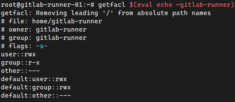
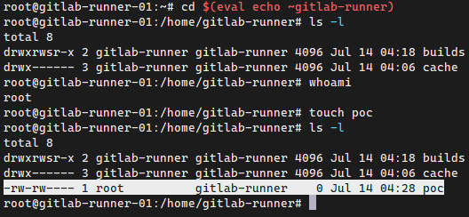

+++ 
draft = false
date = 2022-08-27T22:28:25+03:00
title = "Gitlab Runner with shell executor, permission issues never again!"
description = "A hack to tweak gitlab shell runner on Linux to bypass permission issues and errors on pipelines"
slug = ""
authors = ["Sotirios Roussis"]
tags = ["devops"]
categories = ["software", "pipelines", "ci"]
externalLink = ""
series = ["gitlab"]
+++

# The problem

Runner fails to remove files from previous builds or from previous CI stages.

```plain
Using Shell executor...
Running on centos-512mb-nyc1-01...
rm: cannot remove ‘/home/gitlab-runner/builds/fcdcff7a/0/grupoirona/turnateme/turnateme/__pycache__/__init__.cpython-35.pyc’: Permission denied
rm: cannot remove ‘/home/gitlab-runner/builds/fcdcff7a/0/grupoirona/turnateme/turnateme/__pycache__/urls.cpython-35.pyc’: Permission denied
rm: cannot remove ‘/home/gitlab-runner/builds/fcdcff7a/0/grupoirona/turnateme/turnateme/__pycache__/api_urls.cpython-35.pyc’: Permission denied
rm: cannot remove ‘/home/gitlab-runner/builds/fcdcff7a/0/grupoirona/turnateme/turnateme/settings/__pycache__/__init__.cpython-35.pyc’: Permission denied
....
....
....
goes on and on for every single file
```

# The root cause

For small enterprises or personal projects, usually, `gitlab-runner` daemon is installed on the system and is using the user `gitlab-runner` and group `gitlab-runner`.

This is OK, but when the pipelines are using Docker behind the scenes (to spin up a container to build an image for instance), things are getting complicated.

99% percent of the time, these temp Docker containers are using `root` permissions inside the container to do stuff and is highly possible your Dockerfile is mounting **files** inside (bind) that will have `gitlab-runner`'s permissions. Docker is doing its work and when it's done, gitlab runner has to clean the things up and this is the step that these errors are showing up.

# The solution

> TLDR; Linux ACLs

Just run these commands as root to make the `gitlab-runner`s home directory, collaborative. It means that whatever file is created under this directory, it will have the same group, `gitlab-runner` and at least read and write permissions:

```bash
chmod g+s $(eval echo ~gitlab-runner)
setfacl -m "default:group::rwx" $(eval echo ~gitlab-runner)
getfacl $(eval echo ~gitlab-runner)
```

You should see the below output:



Go to that directory and verify the above change by creating a `poc` file **as root**:

```bash
cd $(eval echo ~gitlab-runner)
touch poc
ls -l
```

As you can see the file is owned by the user `root` and group `gitlab-runner` and has read and write permissions:


